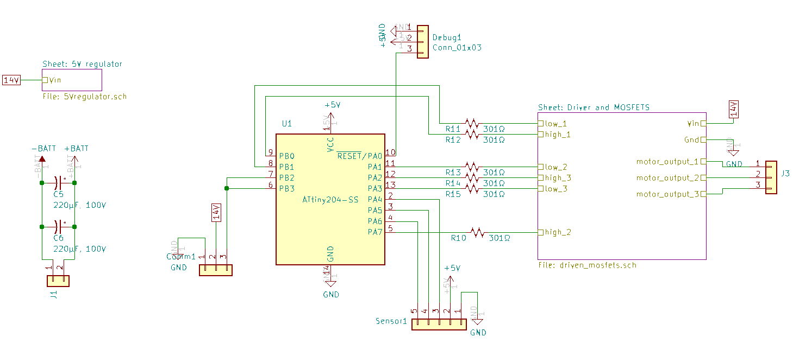
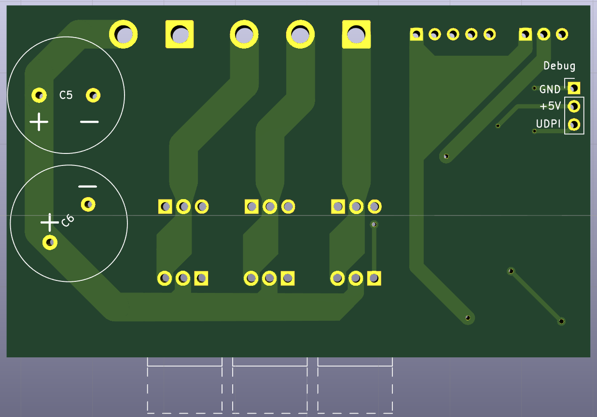

# Schematic

[ATtiny204 datasheet](http://ww1.microchip.com/downloads/en/devicedoc/50002687a.pdf)
# Sheet: 5V Regulator

[AS78L05 datasheet](https://www.diodes.com/assets/Datasheets/AS78Lxx.pdf)
# Sheet: Driver and MOSFETS

[IRS2334 datasheet](https://www.infineon.com/dgdl/irs2334pbf.pdf?fileId=5546d462533600a40153567aa9fe280b)
# Sheet: MOSFET Pair

# PCB Front

# PCB Back

